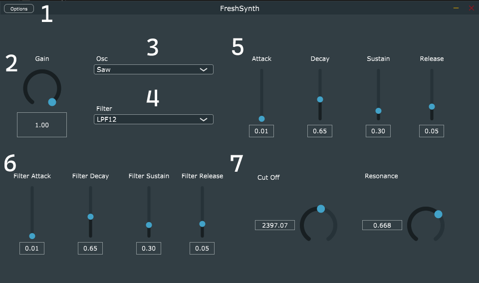

# Fresh Synth of Bel Air

A fun cross-platform synthesizer to play around with. Created for Bart Massey's CS-510 Music, Sound and Computers course at PSU in Spring 2022

## Authors

Peter Wells  
Eliza Sohn

## Features

This is a simple subtractive synthesizer made in the [JUCE](https://juce.com/) framework. It features

* Midi controller support
* Standalone and VST3 support
* 1x Monophonic Selectable Oscillator (sine, saw, square)
* 1x VCA ADSR envelope controller
* 1x Switchable Ladder filter with cutoff and resonance controls. (Filters include Lowpass, Highpass, and Bandpass each with 12 or 24 db slopes)
* 1x Gain control

## UI Layout and Usage



1. Options screen where you can set audio and MIDI controller settings
2. Overall gain control [currently not-implemented]
3. Oscillator Selection menu (Sine, Saw, and Square)
4. Filter Selection menu (lowpass, highpass, bandpass filters with 12 or 24 db slopes)
5. Amplitude ADSR controller section
6. Filter controller section section

Once configured, simply play notes on your midi device and change parameters for some synthesizer goodness! (Bonus points if you play the Fresh Prince of Bel Air theme song)

## Usage Troubleshooting

If you don't hear any sound coming out of the synth:

* Check the options screen located on the top left of the application window to make sure the correct midi controller and audio driver are selected

## Installation Windows / OSX

1. Clone this Repo
2. Download and extract [JUCE](https://juce.com/get-juce)
3. Run the Projucer and `file->open->FreshSynth.jucer` in the repo's root directory
4. You will need to point projucer to the Juce and modules folders. Do this in Projucer from the `file->global paths` menu
5. Select your exporter (supported: Visual Studio 2019, Xcode, Linux Makefile) and press the icon to open in your selected IDE
6. In the IDE build the project and it should open as a standalone application. This should also place VST3 files in the appropriate build folders

## Linux Installation Notes

You will need to have a C++ compiler, make, and a series of dependencies in order for this project to build.  
From the [Official Documentation](https://github.com/juce-framework/JUCE/blob/master/docs/Linux%20Dependencies.md)
```
sudo apt update
sudo apt install libasound2-dev libjack-jackd2-dev \
    ladspa-sdk \
    libcurl4-openssl-dev  \
    libfreetype6-dev \
    libx11-dev libxcomposite-dev libxcursor-dev libxcursor-dev libxext-dev libxinerama-dev libxrandr-dev libxrender-dev \
    libwebkit2gtk-4.0-dev \
    libglu1-mesa-dev mesa-common-dev
```
Instead of exporting the project to an IDE and building there we must use the make file

1. Follow steps 1-4 above
2. Press `file->save` to save the project and generate a makefile
3. With the correct dependencies installed: navigate to `fresh-synth-of-bel-air/Builds/LinuxMakeFile` in the terminal and run `make`. This will build the project
4. Once complete, navigate to `fresh-synth-of-bel-air/Builds/LinuxMakefile/build` and run the `FreshSynth` file to open the synth

## Planned Features

* Filter ADSR envelope with amount knob
* Polyphonic playback
* Rewritten oscillator class
* Second oscillator with fine tune control
* Chorus effect
* Delay effect
* Midi-file playback support

## Project Retrospective

### What was built

See above!

### How it worked

A great deal of making this project was spent researching how the Juce framework works. We found several tutorials and videos explaining the basics of the pipeline and used it to set up the scaffolding for our synthesizer. Once we got over the initial hurdle of setting up a basic project in the frame work, we started diving further into the [API Documentation](https://docs.juce.com/master/index.html) to start adding new features. Having that basic framework in place and learning the basics of JUCE made it easier to start adding on components and greatly sped up development.

### What didn't work

There is still a great deal about how Juce works that remains a mystery and a seemingly endless number of ways to approach different problems. This isn't helped by the somewhat vague tone the documentation can take. This means that sometimes we will go down a rabbit hole implementing one feature for a long time only to discover a new class that does the work for us. We have also had some trouble with the Juce's oscillator and ADSR classes. They seem to have several strange bugs (for one the ADSR will hold onto notes randomly if you set the sustain low enough) and general quirks that are undesirable. In the future we plan to replace these classes with custom ones that perform better.

### What lessons learned

Like any project using a new framework/technology, there was a lot more research that went into building this synthesizer than we even anticipated. So by that token, starting earlier on researching and building out several prototypes beforehand would have been ideal.

## References

* [JUCE: API Documentation](https://docs.juce.com/master/index.html)
* [JUCE: Handling MIDI Events](https://docs.juce.com/master/tutorial_handling_midi_events.html)
* [JUCE: Build a MIDI Synthesizer](https://docs.juce.com/master/tutorial_synth_using_midi_input.html)
* [The Audio Programmer: Building Your First Plug-In (JUCE overview)](https://youtu.be/Bw_OkHNpj1M)
* [The Audio Programmer: Let's Build a Synth with Juce Series](https://youtu.be/nQR-wtzsRhA)
